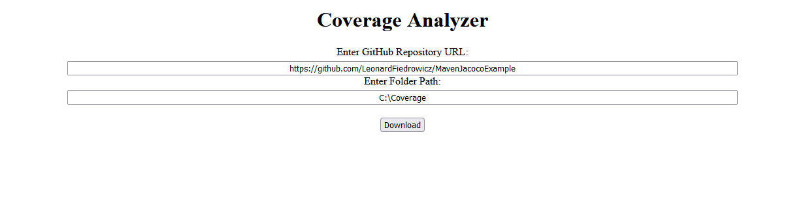
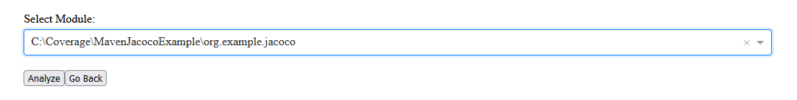
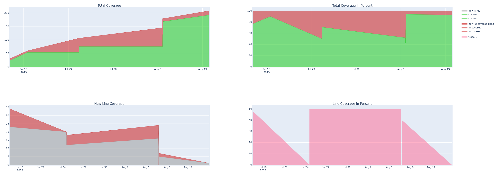
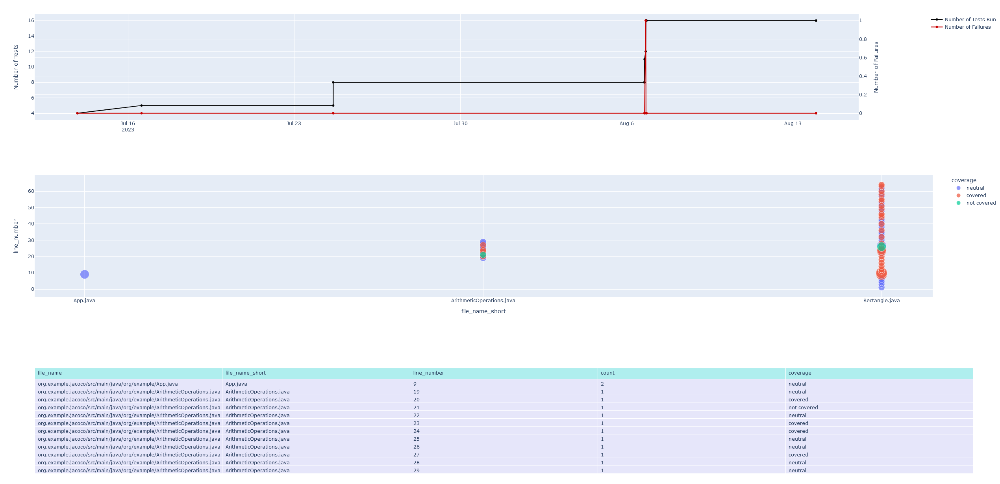

# dTCE

This project analyzes the code coverage of a given project over multiple versions 
and displays the gathered data in a Plotly Dash web-interface. The repository has to be written in Java and use Maven.

### Usage Example:
Enter URL to repository and location where the repository should be downloaded. 
Click Download to continue.

Select Maven module if applicable. Click on Analyze to continue. This gathers commit information 
and execute the selected module at that commit version. By default, there will be 15 commits gathered. 
This process may take  a long time, check the console for progress. 

Graphs and Tables

